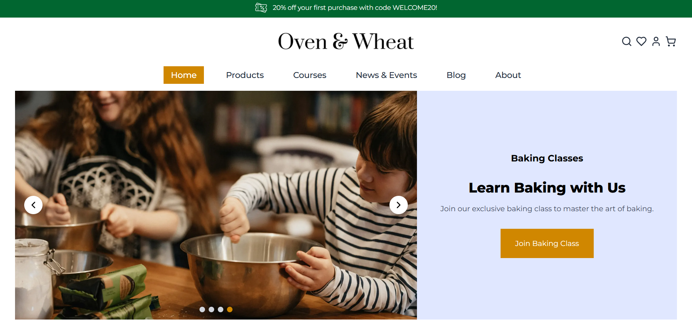
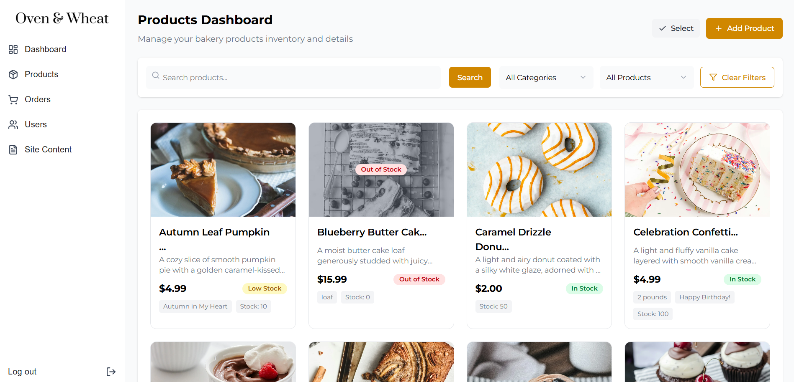

# 🍞 Oven & Wheat – Online Bakery Website

**Oven & Wheat** is a modern, full-featured online bakery platform built with **Next.js**, **React**, **TypeScript**, and **Tailwind CSS**. It offers a complete e-commerce and content management solution, including product listings, course offerings, an admin dashboard, and a seamless user experience from browsing to checkout.

---

## 🌐 Live Preview

🔗 [Visit the Live Site](https://ecommerce-website-umber-nine.vercel.app/)



---

## 🚀 Tech Stack

- **Frontend**: Next.js 15, React 19, TypeScript
- **Styling**: Tailwind CSS
- **Authentication**: Custom login/register system
- **Payment Processing**: Stripe _(planned)_
- **Maps Integration**: _(planned)_
- **Content Management**: Admin dashboard with full CRUD operations

---

## ✨ Features

### 🔐 Authentication System

- User registration and login ✅
- Protected routes and user authorization ✅

### 🏠 Core Pages

- **Landing Page** ✅ (Complete)
- **Products Page** ✅ (Complete)
- **News & Events Page**✅ ( using mock data)
- **Courses Page** ✅ (using mock data)
- **Blog Page** ✅ (click to post not yet functional❗)
- **About Us Page** ✅ (Complete – Static content)

### 🧭 Navigation Bar (Navbar)

- Responsive desktop and mobile navigation ✅
- User profile dropdown with options ✅
- Authentication status display (login/logout) ✅
- Search input with live product search results ✅
- Shopping cart and wishlist icons 🔄 (In progress)

### 🛒 E-commerce Features

#### **Product Catalog** ✅

- **Advanced Filtering** ✅

  - Search
  - Price range slider with quick-select buttons
  - Category filtering
  - Ingredient-based filtering
  - Collection filtering
  - Seasonal/occasion-based filtering
  - Mobile-responsive filter sidebar
  - Clear filters option

- **Product Sorting** ✅

  - Newest/Oldest
  - Price (Low to High / High to Low)
  - Best Selling
  - Alphabetical (A–Z / Z–A)
  - Biggest Discount

#### **Shopping Cart** ✅

- Add to cart from listings (Quick Shop)
- Dedicated product detail pages
- Cart management via navbar

#### **Wishlist / Favorites** ✅

- Save favorite products

#### **Payment** 📅

- Planned Stripe integration

---

### 📚 Course Management System

- **Course Catalog** 📅

  - Online and on-site courses
  - Filtering and search

- **Booking System** 📅

  - Schedule and availability management
  - Location-based offerings

- **Branch Locations** 📅

  - Interactive map integration

---

### 👤 User Dashboard & Membership

- **Membership Tiers** 📅

  - Multiple levels with customized UI
  - Tier-based pricing and perks

- **User Profile Management** 📅

  - Edit profile info
  - View order and course history
  - Manage reviews, wishlist, and coupons

---

### 🔧 Admin Dashboard

- **Product Management** 🛠️ (temporarily not fully functional due to database changes)
  

- **Content Management** 📅

  - Landing page slider
  - Category and blog management
  - Course content control

- **Site Administration** 📅

  - User, order, review, and report management
  - Analytics and reporting

---

## 🛠️ Installation & Setup

1. **Clone the repository**

   ```bash
   git clone https://github.com/pangphaichit/ecommerce-website.git
   cd oven-wheat-bakery
   ```

2. **Install dependencies**

   ```bash
   npm install
   # or
   yarn install
   ```

3. **Run the development server**

   ```bash
   npm run dev
   # or
   yarn dev
   ```

4. **Open your browser**
   Visit: `http://localhost:3000`

---

## 📋 Development Roadmap

### Phase 1: Core E-commerce _(Current)_

- [x] Landing page
- [x] Product catalog
- [x] Admin product CRUD
- [x] User authentication
- [ ] Shopping cart
- [ ] Wishlist system
- [ ] Stripe payment integration

### Phase 2: Course System

- [ ] Course catalog with filtering
- [ ] Online course platform
- [ ] On-site course booking
- [ ] Branch location mapping
- [ ] Admin course panel

### Phase 3: User Experience

- [ ] Membership tiers
- [ ] User dashboard
- [ ] Profile and order history
- [ ] Review and coupon systems

### Phase 4: Advanced Admin Features

- [ ] Content management
- [ ] Slider and category control
- [ ] Blog admin
- [ ] Analytics
- [ ] User management

### Phase 5: Optimization & Enhancements

- [ ] SEO improvements
- [ ] Performance optimization
- [ ] Mobile responsiveness
- [ ] Accessibility compliance
- [ ] Testing setup

---

## 🎯 Current Focus

**Shopping Cart & Wishlist Implementation**

- Add to cart from product listings and product pages
- Build cart management interface
- Implement wishlist functionality
- Integrate both features into the navbar

---

## 🚀 Upcoming Features

1. Stripe payment integration
2. Online and on-site course platform
3. Booking system for classes
4. Membership tiers with perks
5. Full admin CMS capabilities

---

**Note**:

- ✅ = Complete
- 🔄 = Actively being implemented
- 🚧 = In progress
- 📅 = Planned
- 🛠️ = fixing existing issues

---
